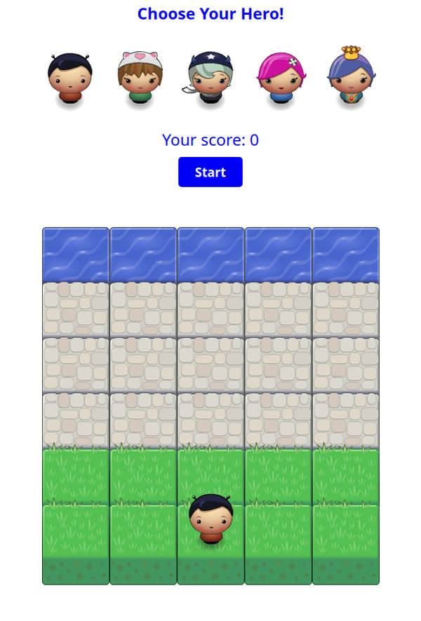
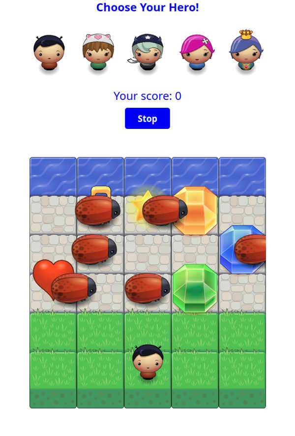
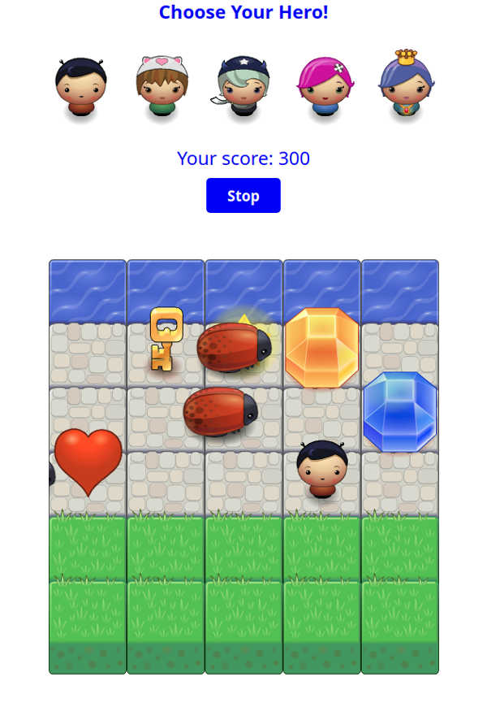
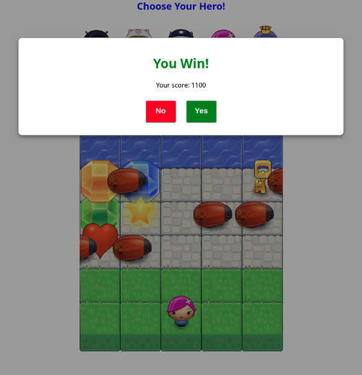
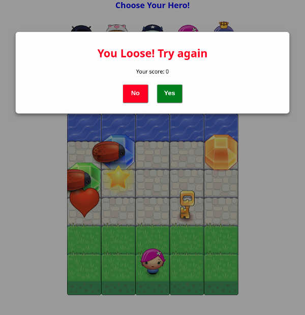

Vlad's frontend-nanodegree-arcade-game
===============================

##### This project is forked from [**Udacity frontend-nanodegree-arcade-game**](https://github.com/udacity/frontend-nanodegree-arcade-game)

## Table of Contents

* [Instructions](#instructions)

* [Game's Screenshots](#screenshots)

* [Authors](#authors)

## Installing

No installation required. You need only web browser.

## Instructions

##### The rules are simple:

* The game starts or stops by clicking Start or Stop button
* Select your hero
* Start moving a hero by pressing keyboard's buttons (up, right, down, left)
* To win the game you need to reach water avoiding collision with enemies(beetles).If you reaches water you earnes 500 points
* There are valuable items on the game's desk. You can collect them earning points to improve the score of the game
* If you collided with an enemy the game and the game's score will reset, your hero will return to initial position

##### Cost of Items

200 points

300 points

500 points

700 points

800 points

1000 points

## Game's screenshots

##### Game's desk

##### Game is started

##### Scores are earned

##### You won!

##### You loose

## Authors

* **Richard Kalehoff** _- initial work -_ [richardkalehoff](https://github.com/richardkalehoff)
* **Vlad Sivirin** _- some styles and some JavaScript code -_ [vvs888](https://github.com/vvs888)
